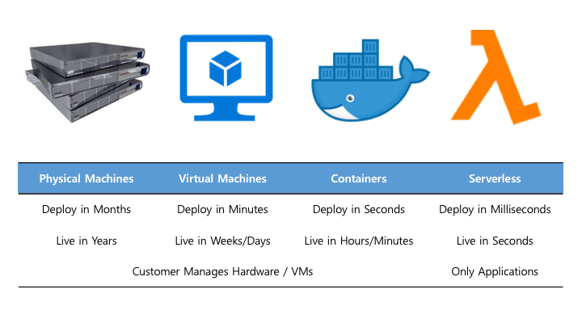
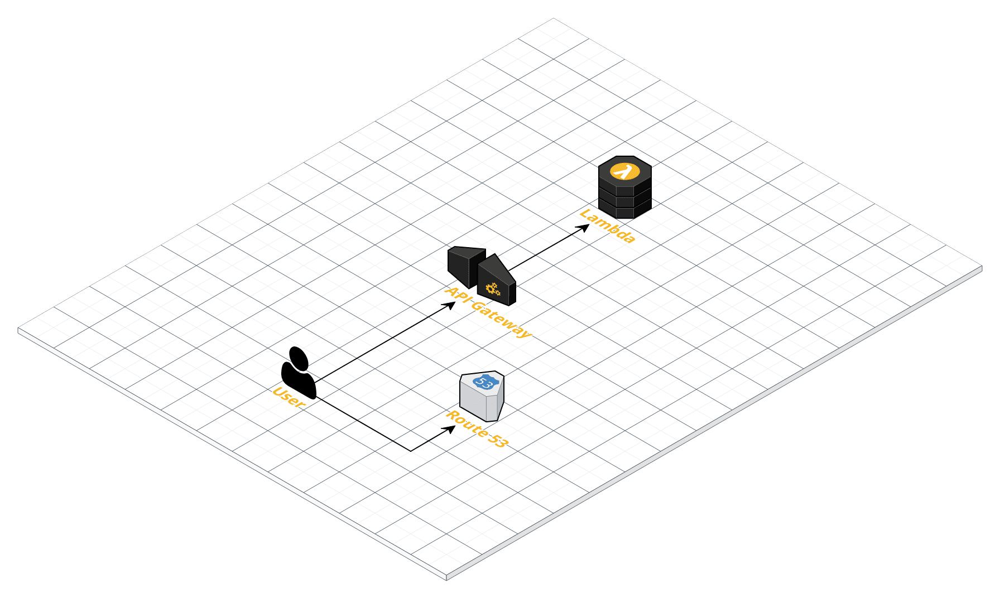
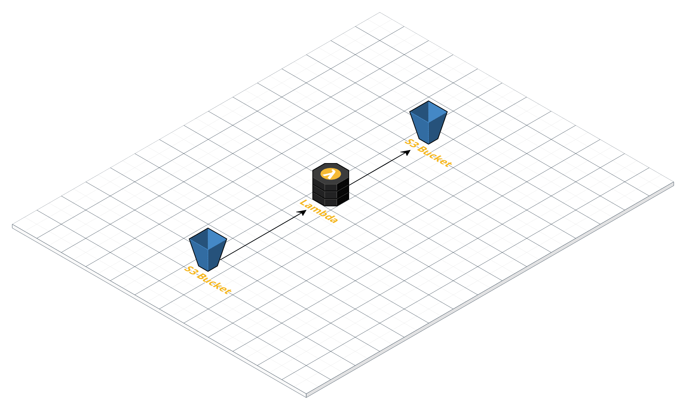
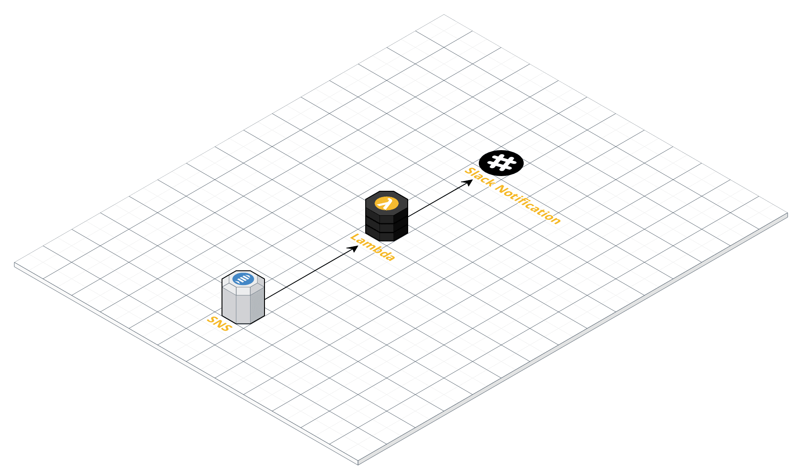
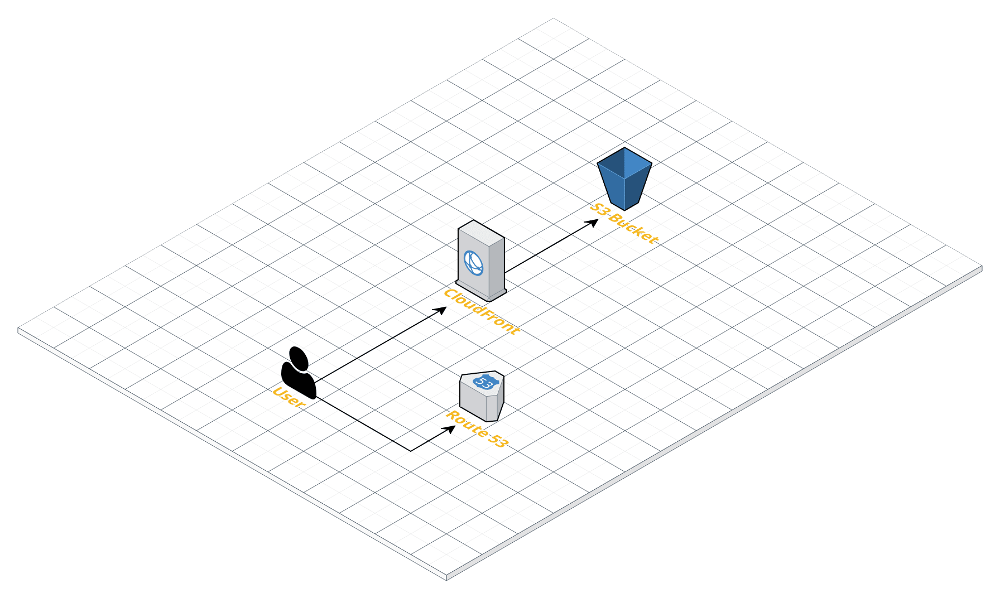
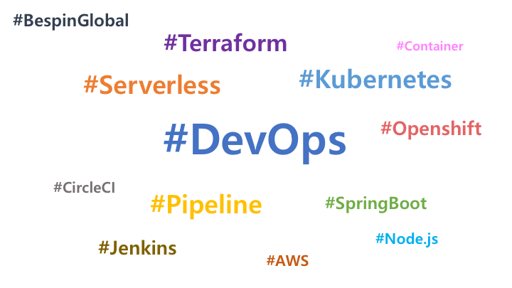

# Terraform Serverless

---

## Evolution of Deployment

> 

Note:
- 서비스를 개발하고 배포하여 운영하기 위한 환경으로 물리머신, 가상머신, 컨테이너, 서버리스 가 있습니다.
- 물리머신은 발주하고 설치하여 운영하기까지 몇개월 혹은 몇일이 소요 될수 있고, 이 머신은 몇년간 유지 됩니다.
- 가상머신은 즉시 사용 가능 하나, 운영체제가 부팅을 하고 서비스를 인스톨하는데 몇분 이상이 소요 됩니다.
- 컨테이너는 이미 클러스터가 구성되어있는 상태에서 런타임과 어플리케이션이 시작되므로 몇초면 시작할수 있습니다.
- 서버리스는 머신과 운영체제 환경을 모두 프로바이더가 제공하므로, 개발자는 코드만 배포하면되고, 즉시 사용가능 합니다.

---

## DevOps

* Infrastructure
* Source Code
* Pipeline

Note:
- 모든 개발/운영 환경을 보면 3가지로 나눌수 있습니다.
- 인프라스트럭처, 소스코드, 빌드/배포 파이프라인 입니다. 

---

### Infrastructure

* Lambda
* S3 Bucket
* Api Gateway
* SNS
* ...

Note:
- 인프라는 아마존을 예를들어 몇가지만 살펴보면 이런 서비스들이 존재합니다.

---

### Infrastructure as Code

* Terraform

Note:
- 가상환경에서 인프라는 코드로 관리 할수 있고, IaC 하면 테라폼이죠.

---

### Source Code

* Java
* Node.js
* Python
* GO
* ...

Note:
- 소스코드는 원하시는 언어를 사용하시면 됩니다.

---

### Pipeline

* Shell
* Jenkins
* Circle CI
* GitLab CI/CD
* ...

Note:
- 빌드/배포/운영 을 위해 이런 것들을 사용 할수 있습니다.

---

### Serverless

* Terraform
* Circle CI

Note:
- 서버리스 서비스를 배포/운영 하기 위하여 Terraform 과 Circle CI 를 사용해 봅니다.

---

## Examples

* Web API
* Image Resize
* Notification
* Static Web

Note:
- 서버리스는 조합과 활용에 따라 수많은 서비스를 구성 할수 있는데요.
- 대표적으로 몇가지만 예를들면 이런 것들이 있습니다.

---

### Web API

* Route53 > API Gateway > Lambda

> 

Note:
- API 서비스를 위해 도메인과 엔드포인트가 필요 하고요.
- 이것을 API Gateway 에서 받아 Lambda Function 을 Invoke 합니다.
- 이후에는 DynamoDB 에 저장 할수 있고, 또 다른 서비스를 활용 할수 있습니다.

---

### Image Resize

* S3 > Lambda > S3

> 

Note:
- S3 Bucket 에 업로드 된 이미지를 리사이즈 하여 다시 S3 Bucket 에 저장 할수 있습니다.

---

### Notification

* SNS > Lambda > Slack

> 

Note:
- 어떤 서비스에서 문제가 발생하고, 이를 SNS Topic 에 보내게 되면, 
- Lambda 에서 받아서 Slack 으로 Notification 을 보낼수 있습니다.

---

### Static Web

* Route53 > Cloud Front > S3

> 

Note:
- Lambda 를 사용한 서버리스 서비스 외에도,
- S3 Bucket 에 올린 정적 파일을 Cloud Front 를 통하여 서비스 할수 있습니다.
- 물론 Domain 과 SSL 인증서를 붙여서 말이지요.

---

## Circle CI

* Workflow
* Schedule

Note:
- 이제 이런 구성을 AWS 에 생성/운영 해야 하는데요.
- Circle CI 에서는 Workflow 와 Schedule 을 제공 하고 있습니다.

---

### Workflow

* Docker based Pipeline
* Push and Deploy

Note:
- 파이프라인은 Docker 기반으로 Jobs 을 구성 하며,
- maven, node 이미지 뿐만 아니라, terraform 이미지도 사용 할수 있습니다.
- 그리고 인프라 코드가 변경 되면 자동으로 재 배포를 진행 합니다.

---

### Schedules

* Auto Run at Specific Time
* Synchronize Code and Infra

Note:
- 스케줄을 이용하면 매일 지정된 시간에 Job 을 수행 할수 있습니다.
- 인프라를 AWS Web Console 을 통해 관리하면서 문제는 누가 어떤 설정을 어떻게 바꿨는지 알수가 없다는 겁니다.
- 이것을 코드로 관리하게 되면 언제 누가 무엇을 변경했는지 추적이 가능 하고,
- 코드에 기록된 설정으로 언제든지 원복이 가능 하게 됩니다.

---

## Demo

Note:
GitHub > Circle CI > AWS Console (Lambda, API G/W, S3, SNS, Route53)
* https://github.com/nalbam/terraform-serverless/blob/master/main.tf
* https://circleci.com/gh/nalbam/terraform-serverless
* https://demo-api.saymoji.com/demos/3
* https://demo-static.saymoji.com/

---

## Thank You

---

## We are hiring...

> 

* jungyoul.yu@bespinglobal.com
