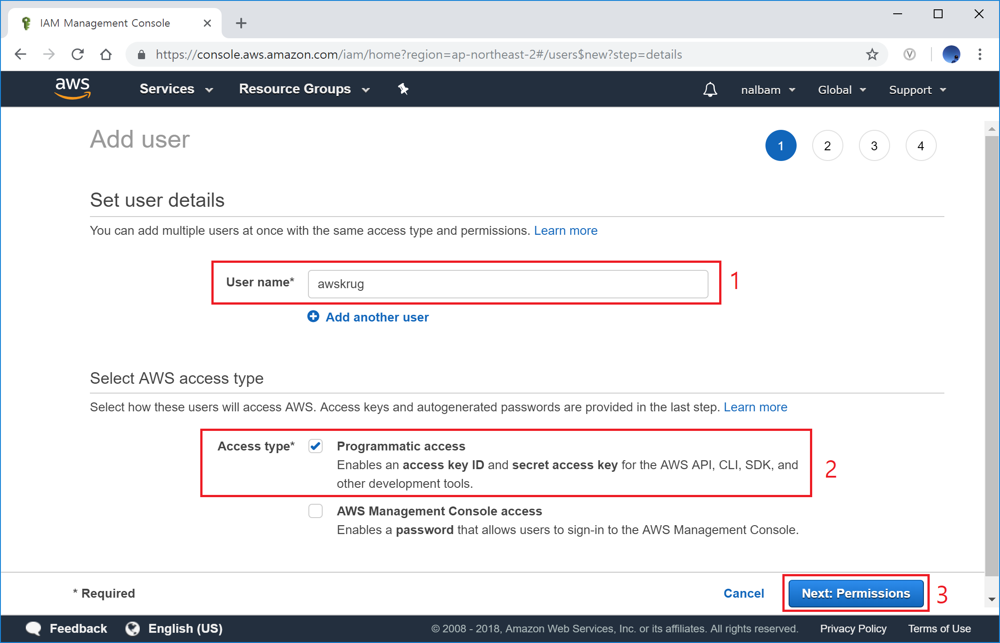
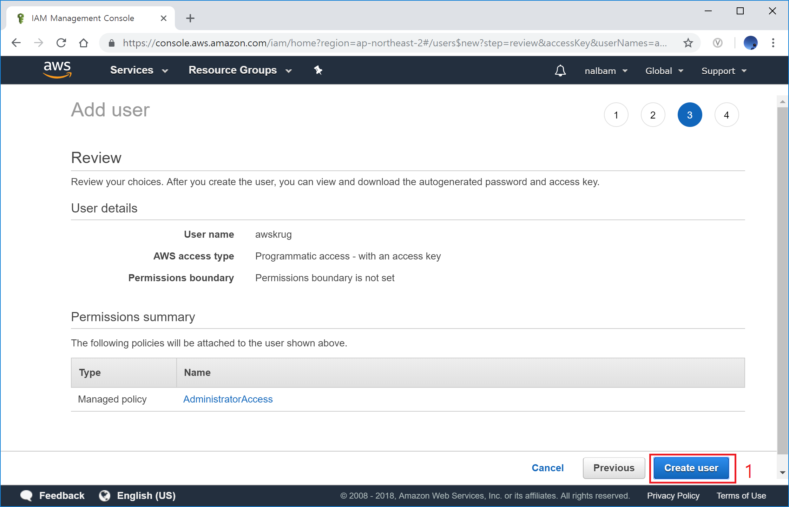
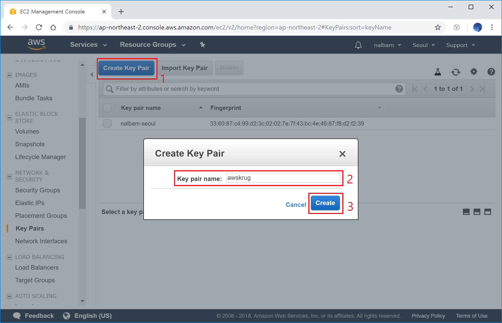
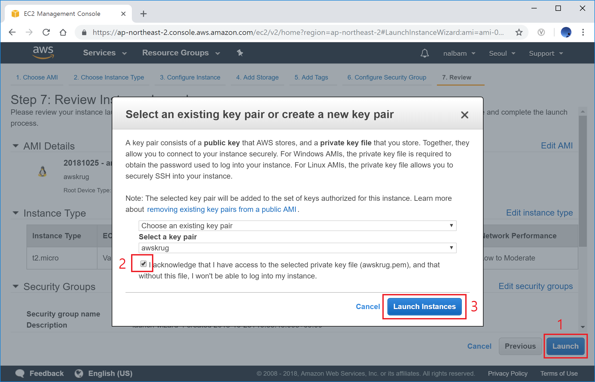
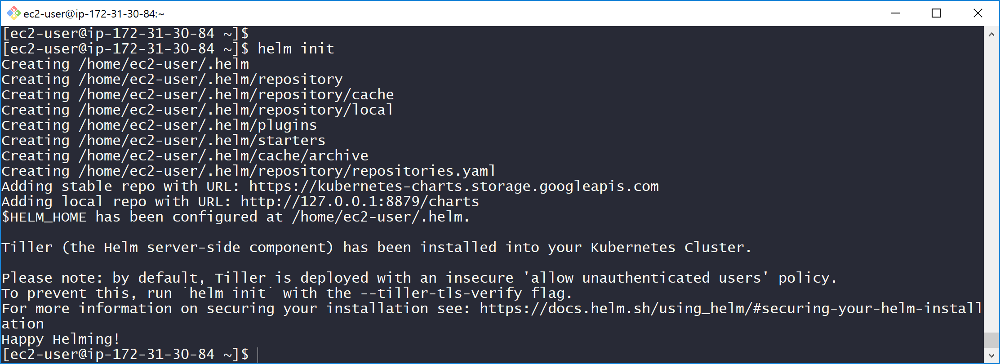
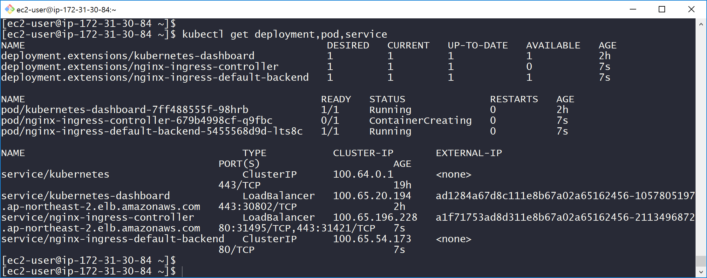
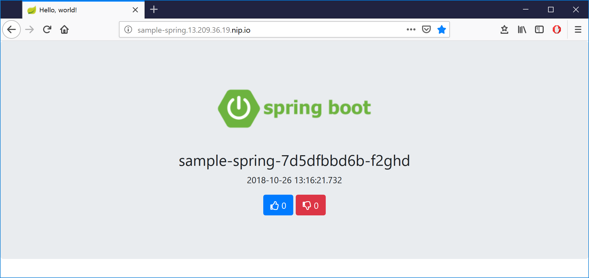
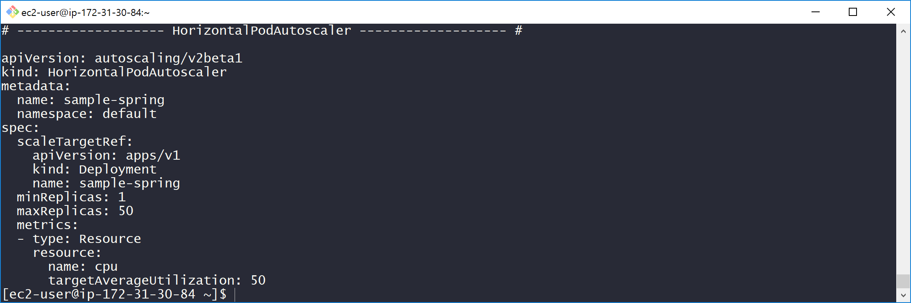
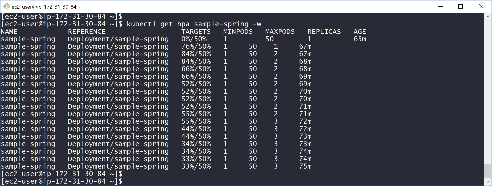
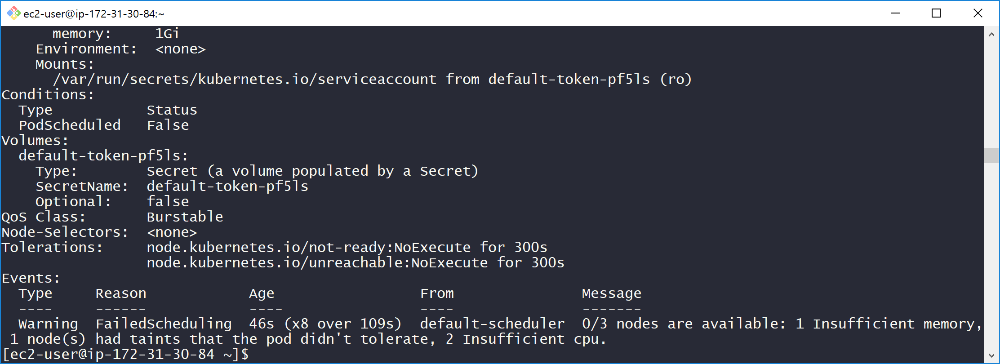

# Kubernetes Hands-on

> 이번 컨테이너 핸즈온 세번째 세션에서는 Kubernetes Cluster 를 아마존웹서비스에 구성하게 될 것 입니다. 쿠버네티스는 컨테이너화된 어플리케이션의 관리를 위한 오픈소스 시스템으로 이번 세션은 이미 쿠버네티스의 기본 내용을 알고 있는 개발자를 위한 세션이며, 쿠버네티스의 자세한 설명은 생략 하겠습니다.

## Index

Kops 로 쿠버네티스 클러스터를 구성하며, Helm 으로 쿠버네티스 패키지를 설치 하도록 하겠습니다.
Ingress Controller 를 설치하여 도메인을 서비스로 라우팅을 하고, Sample Spring Application 에 도메인을 연결해 봅니다.
그리고 어플리케이션이 부하를 받아 더 많은 자원이 필요 할때 Horizontal Pod Autoscaler 로 Pod 가 늘어나는 실험을 하겠습니다.
또한 더 많은 부하를 받아 클러스터 확장이 필요할때 Cluster Autoscaler 로 Node 를 늘려 보겠습니다.

<!-- TOC depthFrom:2 depthTo:6 withLinks:1 updateOnSave:1 orderedList:0 -->

* [Requirement](#requirement)
* [Bastion Host](#bastion-host)
* [Kubernetes Cluster](#kubernetes-cluster)
* [Kubernetes Package Manager](#kubernetes-package-manager)
* [Ingress Controller](#ingress-controller)
* [Sample Application](#sample-application)
* [Metrics Server](#metrics-server)
* [Horizontal Pod Autoscaler](#horizontal-pod-autoscaler)
* [Cluster Autoscaler](#cluster-autoscaler)
* [Clean Up](#clean-up)

<!-- /TOC -->

## Requirement

> 시작하기 전에 모든 사용자는 AWS 계정이 생성되어 있어야 합니다. 또한 보안되지 않은 도메인을 원할 하게 접속 할 수 있도록 파이어폭스 브라우저가 필요 합니다. 또한, 윈도우 사용자는 git bash 가 설치 되어 있어야 합니다.

* 공통
  * AWS 계정: <https://aws.amazon.com/ko/>
  * FireFox: <https://www.mozilla.org/ko/firefox/new/>
* 윈도우 사용자
  * Git Bash: <https://git-scm.com/download/win>

### AWS IAM - Access keys

AWS 객체들을 관리하기 위하여 Access Key 를 발급 받습니다.

* <https://console.aws.amazon.com/iam/home?region=ap-northeast-2> 를 브라우저에서 엽니다.
* 좌측 메뉴에서 Users 를 선택합니다.
* Add user 버튼으로 새 사용자를 만듭니다.
* User name 에 awskrug 를 입력합니다.
* Programmatic access 를 체크합니다.
* Next: Permissions 버튼을 눌러 다음 화면으로 이동합니다. <그림 1-1>
* Attach existing policies directly 를 선택합니다.
* AdministratorAccess 를 검색하여 선택합니다.
* Next: Review 버튼을 눌러 다음 화면으로 이동합니다. <그림 1-2>
* Create user 버튼을 눌러 새 유저를 만듭니다. <그립 1-3>
* 생성된 Access key ID와 Secret access key 는 잘 저장해 둡니다. <그림 1-4>







* 발급 받은 키는 유출되지 않도록 잘 관리 해야 합니다.
* 이번 세션에서는 편의상 Administrator 권한을 부여 하였습니다.
* Administrator 는 너무 많은 권한을 가지고 있고, 이를 가진 유저 생성은 추천하지 않습니다.

### AWS EC2 - Key Pairs

생성할 Instance 에 접속하기 위하여 프라이빗 키를 발급 받습니다.

* <https://ap-northeast-2.console.aws.amazon.com/ec2/v2/home> 를 브라우저에서 엽니다.
* 좌측 메뉴에서 `Key Pairs` 를 선택합니다.
* `Create Key Pair` 버튼으로 새 키페어를 생성합니다.
* 이름은 `awskrug` 로 하겠습니다. <그림 1-5>
* 프라이빗 키 파일을 잘 저장해 둡니다. (파일명은 `awskrug.pem` 입니다.)



## Bastion Host

> 윈도우, 맥, 리눅스 등 모든 사용자가 같은 환경을 구성하기 어렵기 때문에 Bastion 이라 불리는 EC2 Instance 를 만들고 SSH로 접속 하여 진행 하겠습니다.

### AWS EC2 - Instance

빠른 진행을 위하여 필요한 툴이 미리 설치된 AMI 로 부터 인스턴스를 생성 합니다.

* <https://ap-northeast-2.console.aws.amazon.com/ec2/v2/home> 를 브라우저에서 엽니다.
* 좌측 메뉴에서 `AMIs` 를 선택합니다.
* `Owned by me` 를 `Public images` 로 변경합니다.
* Add filter 에서 AMI ID: 를 선택 하고 `ami-0c5f492d14b590d42` 를 입력합니다. <그림 1-6>
* 검색된 이미지로 `Launch` 를 선택 합니다.
* 기본 값인 `t2.micro` 를 사용 하겠습니다.
* `Review and Launch` 버튼을 눌러 다음 화면으로 이동합니다. <그림 1-7>
* `Launch` 버튼을 눌러 인스턴스를 생성합니다.
* `Select a key pair` 에 `awskrug` 가 선택 되었는지 확인합니다.
* 체크 박스를 체크 하고, `Launch Instances` 버튼으로 인스턴스를 생성합니다. <그림 1-8>
* 인스턴스 내역으로 가보면 인스턴스가 시작되고 있을것 입니다.
* Public IP 를 복사해 둡니다. <그림 1-9>





* 쉽게 찾는 링크
  * <https://ap-northeast-2.console.aws.amazon.com/ec2/v2/home?region=ap-northeast-2#Images:visibility=public-images;imageId=ami-0c5f492d14b590d42>

* AMI 에 설치된 툴: awscli, kops, kubectl, helm, draft, terraform, openjdk8, maven, nodejs

* Amazon Linux 또는 CentOS 또는 Ubuntu 에서 다음 쉘로 설치 가능 합니다.

```bash
curl -sL toast.sh/tools | bash
```

### AWS EC2 접속 - Windows 사용자 (git bash)

* `git bash` 를 실행 합니다.
* `awskrug.pem` 파일의 권한을 변경합니다.
* 저장해둔 `PUBLIC_IP` 에 `ec2-user` 로 로그인 합니다.

```bash
chmod 600 PEM_PATH/awskrug.pem
ssh -i PEM_PATH/awskrug.pem ec2-user@PUBLIC_IP
```


### AWS EC2 접속 - Mac 사용자 (terminal)

* `Terminal` 을 실행 합니다.
* `awskrug.pem` 파일의 권한을 변경합니다.
* 저장해둔 `PUBLIC_IP` 에 `ec2-user` 로 로그인 합니다.

```bash
chmod 600 PEM_PATH/awskrug.pem
ssh -i PEM_PATH/awskrug.pem ec2-user@PUBLIC_IP
```


### SSH Key Gen

클러스터 내에서 서로 접속 하기 위하여 ssh-key 를 생성 합니다.

```bash
ssh-keygen -q -f ~/.ssh/id_rsa -N ''
```


### AWS Credentials

현재 접속해 있는 Bastion Host 에 AWS 리소스를 관리한 권한을 주기 위하여 Access key ID 와 Secret access key 를 등록합니다.

```bash
aws configure
```


## kubernetes Cluster

이제 쿠버네티스 클러스터를 만들 준비가 거의 끝났습니다.

* 클러스터 이름을 설정 합니다.
* 클러스터 상태를 저장할 S3 Bucket 을 설정 합니다.
* `MY_UNIQUE_ID` 에는 본인의 이름을 넣어 Bucket 을 만들어 주세요.

```bash
export KOPS_CLUSTER_NAME=awskrug.k8s.local
export KOPS_STATE_STORE=s3://kops-awskrug-MY_UNIQUE_ID

aws s3 mb ${KOPS_STATE_STORE} --region ap-northeast-2
```


### Create Cluster

* 이제 클러스터를 만들어 보겠습니다.
* 클라우드는 `AWS` 를 사용할것 이며, Master 는 `c4.large` 1대, Node 는 `t2.medium` 2대로 하겠습니다.

```bash
kops create cluster \
    --cloud=aws \
    --name=${KOPS_CLUSTER_NAME} \
    --state=${KOPS_STATE_STORE} \
    --master-size=c4.large \
    --node-size=t2.medium \
    --node-count=2 \
    --zones=ap-northeast-2a,ap-northeast-2c \
    --network-cidr=10.10.0.0/16 \
    --networking=calico
```


### Edit Cluster

위 명령을 실행해도 아직 클러스터는 만들어지지 않습니다.
위 명령은 kops 상에서 클러스터를 생성한 것이며, AWS 에 적용해 주어야 생성이 됩니다. 실제 생성 하기전 몇가지 수정을 할것 입니다.
명령을 실행하면 에디터로 전환될 것입니다.
Cluster Autoscaler 를 위해 max 값을 `5` 로 변경해주고, `cloudLabels:` 포함 아래 두 줄도 추가해 줍니다.
수정을 완료 했으면 에디터를 저장하고 종료 합니다.

```bash
kops get cluster
```

```bash
Cluster
NAME                 CLOUD    ZONES
cluster.k8s.local    aws      ap-northeast-2a,ap-northeast-2c

Instance Groups
NAME                      ROLE      MACHINETYPE    MIN    MAX    ZONES
master-ap-northeast-2a    Master    c4.large       1      1      ap-northeast-2a
nodes                     Node      t2.medium      2      1      ap-northeast-2a,ap-northeast-2c
```

```bash
kops edit ig nodes
```

```yaml
spec:
  image: kope.io/k8s-1.10-debian-jessie-amd64-hvm-ebs-2018-08-17
  machineType: t2.medium
  maxSize: 5
  minSize: 2
  cloudLabels:
    k8s.io/cluster-autoscaler/enabled: ""
    kubernetes.io/cluster/awskrug.k8s.local: owned
```

### Update Cluster

자 이제 AWS 에 클러스터를 생성할 것 입니다. `kops update` 명령에 `--yes` 옵션을 주어야  클러스터가 생성 됩니다.
VPC, Instance, ELB, Auto Scaling Group 에 관련 객체들이 생성됩니다.
클러스터 생성 완료까지 `7분` 정도 소요 됩니다.

```bash
kops update cluster --name=${KOPS_CLUSTER_NAME} --yes
```


### Validate Cluster

* `kops validate` 명령으로 생성이 완료 되었는지 확인 할 수 있습니다.

```bash
kops validate cluster --name=${KOPS_CLUSTER_NAME}
```


### kubectl

* 생성이 완료 되었으면, 다음 명령으로 정보를 조회 할 수 있습니다.
* 직접 실행해 보세요.

```bash
kubectl get cs
kubectl get node

kubectl get deployment,pod,service --all-namespaces

kubectl get deployment,pod,service --namespace kube-system
kubectl get deployment,pod,service --namespace default
```

* <https://kubernetes.io/docs/tasks/>
* <https://kubernetes.io/docs/reference/kubectl/cheatsheet/>

## Kubernetes Package Manager

> 쿠버네티스에 어플리케이션을 설치하기 위해서 모든 리소스 와 수 많은 설정을 yaml 로 작성하여야 합니다. 하지만 이를 쉽게 도와주는 툴이 있습니다.

### Helm

`Helm` [헮, 헬름] 은 Chart 라는 리소스 정의 묶음을 통하여 리소스를 미리 정해놓고, 간단한 설정만으로 설치 할수 있도록 도와 줍니다.
이미 Bastion Host 에는 helm 이 설치 되어있으므로, 초기화를 해주도록 하겠습니다.

* namespace `kube-system` 에 service-account `tiller` 를 만듭니다.
* kube-system:tiller 에 `cluster-admin` 권한을 줍니다.
* tiller 유저로 `helm init` 을 합니다.
* `Happy Helming!` 이 출력 되었으면 정상 입니다.

```bash
# 유저 생성
kubectl create serviceaccount tiller -n kube-system

# 권한 부여
kubectl create clusterrolebinding cluster-admin:kube-system:tiller \
    --clusterrole=cluster-admin --serviceaccount=kube-system:tiller

# 초기화
helm init --upgrade --service-account=tiller
```



## Ingress Controller

이제 Ingress Controller 인 `nginx-ingress` 으로 도메인을 Cluster 의 Service 로 라우팅해 주겠습니다.
역시 설치가 되면, Pod 상태를 확인해 줍니다.
정상 상태로 변경이 되면 nginx-ingress 역기 ELB 가 생성된것을 확인 할수 있고, ELB 에서 얻은 IP 로 `nip.io` 도메인을 만듭니다.
도메인이 없는 상황을 가정하므로, ELB 에서 IP 를 얻어 nip.io 서비스를 이용했습니다.
<http://nip.io> 는 여러분의 IP 를 도메인처럼 동작 하도록 해주는 서비스 입니다.
IP 와 nip.io 조합의 도메인 앞에 어떤 문자든 IP 로 연결시켜 줍니다.

```bash
# 설치
helm upgrade --install nginx-ingress stable/nginx-ingress

# 조회
kubectl get deployment,pod,service

# ELB 도메인을 획득 합니다.
ELB=$(kubectl get service | grep nginx-ingress-controller | awk '{print $4}')
echo ${ELB}

# ELB 도메인으로 IP 를 획득 합니다.
IP=$(dig +short ${ELB} | head -1)
echo ${IP}

# BASE 도메인
BASE_DOMAIN="${IP}.nip.io"
echo ${BASE_DOMAIN}
```




## Sample Application

도커 허브에 등록되어있는 샘플 스프링 어플리케이션을 여러분의 클러스터에 올려 보도록 하겠습니다.

* `sample-spring.yaml` 파일을 다운로드 합니다.
* sample-spring.yaml 파일의 `BASE_DOMAIN` 을 `${BASE_DOMAIN}` 로 바꿔줍니다.
* sample-spring 을 설치 합니다.

```bash
# 설정 다운로드
curl -sLO https://raw.githubusercontent.com/nalbam/docs/master/201811/Kubernetes/sample/sample-spring.yaml
cat sample-spring.yaml

# 도메인 변경
sed -i -e "s/BASE_DOMAIN/${BASE_DOMAIN}/g" sample-spring.yaml

# 설치
kubectl apply -f sample-spring.yaml

# 조회
kubectl get deployment,service sample-spring
```


그리고 Ingress 의 도메인이 Ingress Controller 와 연결 된것을 확인 할수 있습니다. 그 URL 을 브라우저에서 열어봅니다.

```bash
kubectl get ingress

SAMPLE=$(kubectl get ingress | grep sample-spring | awk '{print $2}')
echo "http://${SAMPLE}"
```




## Metrics Server

CPU 사용량을 얻기 위하여 `metrics-server` 를 설치 합니다.

```bash
# 다운로드
curl -sLO https://raw.githubusercontent.com/nalbam/docs/master/201811/Kubernetes/sample/metrics-server.yaml
cat metrics-server.yaml

# 설치
helm upgrade --install metrics-server stable/metrics-server --values metrics-server.yaml

# 조회
kubectl top pod --all-namespaces
```


## Horizontal Pod Autoscaler

`sample-spring.yaml` 의 `HorizontalPodAutoscaler` 설정을 보면 `최소:1` `최대:50` 으로 설정 되어있고, 매트릭 설정을 보면 CPU 리소스를 참조 하며, 사용량은 `50%` 로 설정 되어있습니다. 또한 `hpa` 를 조회 해 보면 Targets 에 CPU 사용량을 알수 있습니다.



```bash
kubectl get hpa sample-spring
```


자, 이제 설치된 샘플 어플리케이션에 부하를 줘 보겠습니다.
현재 접속하고 있는 Bastion Host 에는 `ab` (apache benchmark) 가 설치 되어있습니다.
이 툴을 통하여 `동시 3개` (concurrency, -c) 에서 `1,000,000개` (requests, -n) 의 요청을 보냅니다.
그리고 새로운 창에서 다시 접속하여 hpa 를 조회해 봅니다. 이때 `-w` 옵션 을 주면 연속해서 조회 할 수 있습니다.
hpa 는 CPU를 50% 이하로 맞추기 위해 노력 합니다.
평균 사용량이 50%가 넘으면 Pod 수를 늘리고 50% 보다 낮고, Pod 가 줄었을때 50% 가 넘지 않을것이라면 Pod 를 줄이게 됩니다.

```bash
# 1백만개, 동시 3
ab -n 1000000 -c 3 http://sample-spring.${BASE_DOMAIN}/stress

kubectl get hpa sample-spring -w

kubectl get pod
```



## Cluster Autoscaler

이번에는 동시 요청수를 늘려보겠습니다. 동시 9개로 요청을 보냅니다.

```bash
# 1백만개, 동시 9
ab -n 1000000 -c 9 http://sample-spring.${BASE_DOMAIN}/stress

kubectl get hpa sample-spring -w

kubectl get pod
```


더 많은 요청으로 더 많은 Pod 가 필요 하게 되며, 이 요청은 쿠버네티스 클러스터의 한계치를 넘을수 있습니다.
Pod 목록을 조회 해보면 `Pending` 상태인 Pod 가 있고, 원인을 확인해 보면 CPU 한계치를 초과하여 더이상 Pod 를 생성 할 수 없음을 알수 있습니다.

```bash
# pod id 조회
POD_ID=$(kubectl get pod | grep sample-spring | grep Pending | head -1 | awk '{print $1}')
echo ${POD_ID}

kubectl describe pod ${POD_ID}
```



이때 클러스터를 Scale Out 을 해주는 서비스가 `Cluster Autoscaler` 입니다.
설정을 다운받아 `AWS_REGION` 과 `CLUSTER_NAME` 을 변경하고 설치 해줍니다.
그리고 노드 상태도 조회 해 봅니다.
아마존 웹서비스 콘솔에서 EC2 내역도 확인해 봅니다.
어느정도 시간이 지나면 노드가 추가 되었고, Pod 가 생성되는 것을 확인 할수 있습니다.

```bash
# 다운로드
curl -sLO https://raw.githubusercontent.com/nalbam/docs/master/201811/Kubernetes/charts/cluster-autoscaler.yaml
cat cluster-autoscaler.yaml

# 설치
helm upgrade --install cluster-autoscaler stable/cluster-autoscaler --values cluster-autoscaler.yaml

kubectl get nodes,pod
```


## Prometheus

## Grafana

## Clean Up

지금까지 AWS 에 쿠버네티스 클러스터를 구성하고, Kubernetes Dashboard 으로 모니터링을 해보고, Ingress Controller 로 도메인을 서비스로 라이팅을 해보고, Sample Spring Application 을 띄워 보고, Metrics Server 로 매트릭을 수집하고, Horizontal Pod Autoscaler 로 Pod 를 Scale Out 하고, 또 Cluster Autoscaler 로 클러스터도 Scale Out 해 보았습니다.

* `이번 실습으로 생성한 리소스는 아래의 명령으로 반드시 지워주셔야 합니다.`
* `원하지 않는 금액이 발생 할수 있습니다.`

```bash
kops delete cluster --name=${KOPS_CLUSTER_NAME} --yes
```

* EC2 Instance (bastion) 를 지웁니다.
  * <https://ap-northeast-2.console.aws.amazon.com/ec2/v2/home?region=ap-northeast-2#Instances>

* EC2 Key Pair 를 지웁니다.
  * <https://ap-northeast-2.console.aws.amazon.com/ec2/v2/home?region=ap-northeast-2#KeyPairs>

* IAM User 를 지웁니다.
  * <https://console.aws.amazon.com/iam/home?region=ap-northeast-2#/users>

## Thank You
